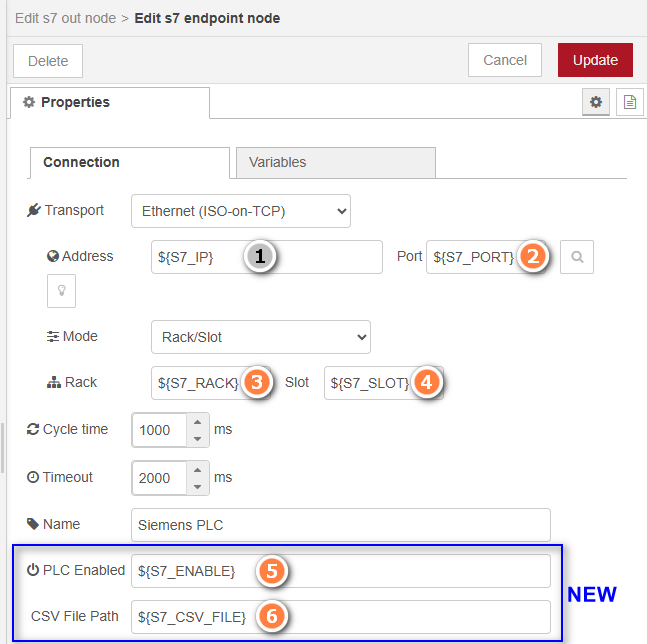

# Documentation for New Features



## S7 Endpoint Configuration Interface

The image above shows the enhanced S7 endpoint configuration interface with numbered references to the new and modified features:

### 1. Address Field (Existing)
Standard IP address configuration for the PLC connection. This field was already functional and no modifications were made.

### 2. Port Field (Enhanced)
**Enhanced with environment variable support:**
- Standard value: `102`
- Environment variable: `${S7_PORT}`
- Custom environment variable: `${YOUR_PORT_VAR}`

### 3. Rack Field (Enhanced) 
**Enhanced with environment variable support:**
- Standard value: `0`
- Environment variable: `${S7_RACK}`
- Custom environment variable: `${YOUR_RACK_VAR}`

### 4. Slot Field (Enhanced)
**Enhanced with environment variable support:**
- Standard value: `2` 
- Environment variable: `${S7_SLOT}`
- Custom environment variable: `${YOUR_SLOT_VAR}`

### 5. PLC Enabled Field (NEW)
**New field for dynamic PLC enable/disable:**
- Empty or `true`: PLC enabled (default behavior)
- `false` or `0`: PLC disabled
- `${S7_ENABLE}`: Environment variable
- Custom environment variable: `${YOUR_ENABLE_VAR}`

When PLC is disabled:
- The endpoint remains in "offline" state
- Write operations fail with "PLC disabled" error
- No connection attempts are made

### 6. CSV File Path Field (NEW)
**New field for external variable configuration:**
- Absolute path: `C:\config\s7_tags.csv`
- Relative path: `./config/tags.csv`
- Environment variable: `${S7_CSV_FILE}`
- Custom environment variable: `${YOUR_CSV_VAR}`

## Dynamic Configuration Management

### CSV File Loading
The CSV file allows loading the variable list from an external file instead of the node configuration. This facilitates:
- Reusing the same configuration across different installations
- Centralized tag management
- Synchronization with external configuration systems

**CSV file format:**
```
address<TAB|;>name
DB1,REAL0	Temperature_1
DB1,REAL4	Temperature_2
MB100	Memory_Byte_100
```

The CSV file takes priority over internal configuration. If the file doesn't exist or is empty, the node configuration is used.

### Environment Variables Benefits
Using environment variables for fields 1-6 allows configuring different environments (development, test, production) using the same flow but with different connection parameters.

### Technical Notes

- Environment variables are automatically resolved by Node-RED
- CSV loading occurs only at node startup
- In case of CSV errors, the node configuration is used with a warning message
- CSV parsing supports TAB (	) and semicolon (;) separators
- Empty lines in CSV are ignored
- Fields 2, 3, 4 maintain backward compatibility with numeric values
- Fields 5 and 6 are completely new additions